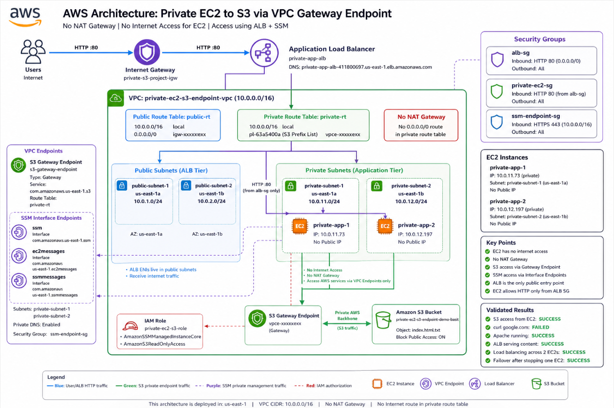

# Private EC2 to S3 via VPC Endpoint — No NAT, No Internet Access

## Project Overview

This project demonstrates how private EC2 instances can securely access Amazon S3 without using a NAT Gateway, public IP address, or direct internet access.

The architecture uses a custom VPC, public subnets for an internet-facing Application Load Balancer, private subnets for EC2 instances, an S3 Gateway VPC Endpoint, SSM Interface Endpoints, IAM roles, and security group referencing.

## Main Architecture

```text
Internet User
    |
    | HTTP :80
    v
Internet-facing ALB
    |
    | HTTP :80
    v
Private EC2 Instances
    |
    | S3 private access
    v
S3 Gateway VPC Endpoint
    |
    | AWS Private Backbone
    v
Private S3 Bucket
```

# Private EC2 to S3 via VPC Endpoint — No NAT, No Internet Access




## Network Details

```text
VPC: private-ec2-s3-endpoint-vpc
CIDR: 10.0.0.0/16

Public Subnets:
public-subnet-1: 10.0.1.0/24
public-subnet-2: 10.0.2.0/24

Private Subnets:
private-subnet-1: 10.0.11.0/24
private-subnet-2: 10.0.12.0/24

EC2 Instances:
private-app-1: ip-10-0-11-73.ec2.internal
private-app-2: ip-10-0-12-197.ec2.internal

S3 Bucket:
private-ec2-s3-endpoint-demo-basit
```

## Route Tables

Public route table:

```text
10.0.0.0/16 -> local
0.0.0.0/0  -> Internet Gateway
```

Private route table:

```text
10.0.0.0/16 -> local
S3 Prefix List pl-xxxx -> S3 Gateway Endpoint vpce-xxxx
```

No NAT Gateway was used.

No internet route was added to the private route table.

## VPC Endpoints

S3 Gateway Endpoint:

```text
Name: s3-gateway-endpoint
Type: Gateway
Service: com.amazonaws.us-east-1.s3
Associated Route Table: private-rt
```

SSM Interface Endpoints:

```text
ssm-interface-endpoint
ec2messages-interface-endpoint
ssmmessages-interface-endpoint
```

These allowed Session Manager access without SSH, public IPs, or NAT Gateway.

## IAM Role

EC2 role:

```text
private-ec2-s3-role
```

Policies attached:

```text
AmazonSSMManagedInstanceCore
AmazonS3ReadOnlyAccess
```

IAM controlled authorization.

The VPC endpoint controlled private network reachability.

Both were required.

## Security Groups

ALB security group:

```text
Inbound:
HTTP 80 from 0.0.0.0/0

Outbound:
All traffic
```

Private EC2 security group:

```text
Inbound:
HTTP 80 from alb-sg only

Outbound:
All traffic
```

SSM endpoint security group:

```text
Inbound:
HTTPS 443 from 10.0.0.0/16

Outbound:
All traffic
```

## EC2 Setup Commands

Commands run on both private EC2 instances:

```bash
sudo dnf update -y
sudo dnf install httpd -y
sudo systemctl enable httpd
sudo systemctl start httpd
sudo systemctl status httpd
```

Copy S3 file to Apache web root:

```bash
sudo aws s3 cp s3://private-ec2-s3-endpoint-demo-basit/index.html.txt /var/www/html/index.html
```

Validate locally:

```bash
cat /var/www/html/index.html
curl http://localhost
sudo ss -tulpn | grep :80
```

## ALB Setup

Target group:

```text
Name: private-ec2-tg
Target Type: Instances
Protocol: HTTP
Port: 80
Health Check Path: /
Targets:
private-app-1
private-app-2
```

Application Load Balancer:

```text
Name: private-app-alb
Scheme: Internet-facing
Subnets:
public-subnet-1
public-subnet-2

Listener:
HTTP 80 -> private-ec2-tg
```

## Flow 1 — User to ALB to Private EC2

```text
Internet User
    |
    | HTTP request
    v
Public ALB
    |
    | ALB security group allows HTTP from internet
    v
Target Group
    |
    | private-ec2-sg allows HTTP only from alb-sg
    v
Private EC2
    |
    | Apache serves webpage
    v
User receives response
```

The EC2 instances have no public IPs.

Users never connect directly to EC2.

The ALB is the only public entry point.

## Flow 2 — Private EC2 Accessing S3

Command:

```bash
sudo aws s3 cp s3://private-ec2-s3-endpoint-demo-basit/index.html.txt /var/www/html/index.html
```

Flow:

```text
Private EC2
    |
    | AWS CLI request to S3
    v
IAM Role Check
    |
    | AmazonS3ReadOnlyAccess allows read access
    v
Private Route Table Lookup
    |
    | S3 prefix list route found
    | pl-xxxx -> vpce-xxxx
    v
S3 Gateway VPC Endpoint
    |
    | AWS private backbone
    v
Amazon S3
    |
    | Object returned
    v
Private EC2 saves file to /var/www/html/index.html
```

IAM answered:

```text
Am I allowed to access S3?
```

The VPC endpoint answered:

```text
Can I privately reach S3?
```

## Flow 3 — SSM Session Manager Access

```text
Admin Browser
    |
    v
AWS Systems Manager Console
    |
    v
SSM Service
    |
    | Private DNS resolves SSM service names to endpoint ENI private IPs
    v
SSM Interface Endpoint ENIs
    |
    | HTTPS 443
    v
Private EC2 SSM Agent
```

Created interface endpoints:

```text
ssm
ec2messages
ssmmessages
```

This worked because EC2 used private interface endpoint ENIs instead of the public internet.

## Flow 4 — Package Installation Without Internet

`dnf install httpd -y` worked even though EC2 had no general internet access.

Flow:

```text
Private EC2
    |
    | dnf install httpd
    v
Amazon Linux repository request
    |
    v
AWS-managed repository/S3-backed path
    |
    v
Private AWS network path
    |
    v
Packages downloaded
```

Validation:

```bash
aws s3 ls
```

worked.

```bash
curl https://google.com
```

failed or timed out.

This proved EC2 had private AWS service access but no general internet access.

## Flow 5 — ALB Load Balancing

To prove load balancing, each EC2 displayed its hostname:

```bash
echo "<h1>Served from $(hostname)</h1>" | sudo tee /var/www/html/index.html
```

Browser refresh showed:

```text
Served from ip-10-0-11-73.ec2.internal
Served from ip-10-0-12-197.ec2.internal
```

Flow:

```text
User refreshes ALB DNS
    |
    v
ALB receives request
    |
    v
Target Group selects healthy target
    |
    +--> private-app-1
    |
    +--> private-app-2
```

## Flow 6 — ALB Failover

One EC2 instance was stopped.

Result:

```text
private-app-2 stopped
private-app-1 healthy
```

Flow:

```text
One EC2 stopped
    |
    v
ALB health check fails for stopped target
    |
    v
Target removed from rotation
    |
    v
Traffic goes only to healthy EC2
```

This proved ALB health checks, failover, and multi-AZ resilience.

## Validation Tests

S3 bucket privacy test:

```text
Direct S3 object URL returned AccessDenied
```

SSM test:

```text
Connected to private EC2 using Session Manager
No SSH used
No public IP used
```

S3 endpoint test:

```bash
aws s3 ls
sudo aws s3 cp s3://private-ec2-s3-endpoint-demo-basit/index.html.txt /var/www/html/index.html
```

Internet test:

```bash
curl https://google.com
```

Result:

```text
Failed or timed out
```

Apache test:

```bash
sudo systemctl status httpd
curl http://localhost
```

ALB test:

```text
Opened ALB DNS in browser
Page loaded successfully
```

Load balancing test:

```text
Browser refresh showed both EC2 hostnames
```

Failover test:

```text
Stopped one EC2
ALB continued serving traffic from healthy EC2
```

## Key Concepts Learned

Private EC2 does not need NAT Gateway to access S3 if an S3 Gateway Endpoint is configured.

Gateway Endpoint:

```text
Route-table based
No ENI
No private IP
No security group
Used for S3 and DynamoDB
Free
```

Interface Endpoint:

```text
ENI-based
Has private IPs
Uses security groups
Uses AWS PrivateLink
Used for SSM and most AWS services
Costs money
```

IAM vs networking:

```text
IAM = authorization
Networking = reachability
```

Route tables vs security groups:

```text
Route table = Can traffic get there?
Security group = Is traffic allowed?
```

## FAQ

### Why did we use a Gateway Endpoint for S3 instead of an Interface Endpoint?

S3 supports Gateway Endpoints. Gateway Endpoints are route-table based, free, highly scalable, and commonly used for S3 and DynamoDB private access.

### What is the difference between Gateway Endpoint and Interface Endpoint?

Gateway Endpoint uses route tables and does not create ENIs.

Interface Endpoint creates ENIs with private IP addresses inside subnets and uses security groups.

### What is an ENI?

ENI means Elastic Network Interface. It is like a virtual network card in AWS.

An EC2 ENI gives the instance private IP connectivity.

An Interface Endpoint ENI gives an AWS service a private entry point inside your VPC.

### Why does an Interface Endpoint create another ENI if EC2 already has one?

Because the EC2 ENI belongs to the EC2 instance.

The Interface Endpoint ENI belongs to the AWS service endpoint.

The EC2 connects to the endpoint ENI, and AWS forwards the traffic privately to the service.

### Why does S3 Gateway Endpoint not create an ENI?

Because S3 Gateway Endpoint is route-table based.

AWS adds a route like:

```text
pl-xxxx -> vpce-xxxx
```

No private IP or ENI is needed.

### Why did we allow HTTPS 443 on the SSM endpoint security group?

SSM communicates over HTTPS 443.

Private EC2 instances needed to connect to the SSM, EC2Messages, and SSMMessages interface endpoints over port 443.

### Could we restrict SSM endpoint access more tightly?

Yes.

Instead of allowing:

```text
10.0.0.0/16
```

we could allow only:

```text
10.0.11.0/24
10.0.12.0/24
```

Even better, we could allow only the private EC2 security group.

### Why is the SSM endpoint still private even though it allows 443?

Security groups do not create internet access.

The SSM endpoint ENIs have private IPs only, no public IPs, and no public route.

The 443 rule only allows private VPC resources to reach the endpoint.

### Why did the EC2 instances have no public IP?

Because they were placed in private subnets and public IP assignment was disabled.

This prevents direct internet access to EC2.

### Why was the ALB placed in public subnets?

The ALB must receive traffic from internet users.

Public subnets have:

```text
0.0.0.0/0 -> Internet Gateway
```

So the internet-facing ALB belongs in public subnets.

### How can the public ALB reach private EC2 instances?

All subnets inside the same VPC can communicate through the local route:

```text
10.0.0.0/16 -> local
```

The ALB reaches private EC2 internally through VPC routing.

### If all subnets can communicate inside the VPC, why can only the ALB reach EC2?

Because routing only creates a path.

The private EC2 security group only allows HTTP traffic from `alb-sg`.

So another resource in the VPC can route toward EC2, but the EC2 security group blocks it unless the source is the ALB security group.

### Why did `curl google.com` fail but `aws s3 ls` worked?

Google requires general internet access.

The private EC2 instances had no NAT Gateway and no internet route.

S3 worked because the private route table had an S3 Gateway Endpoint route.

### How did package installation work without internet?

Amazon Linux package repositories can use AWS-managed service paths. The instance had private AWS service connectivity, so package installation worked while general internet access still failed.

### Why did we test the direct S3 object URL in browser?

To prove the S3 bucket and object were private.

The browser returned:

```text
AccessDenied
```

### Why did we stop one EC2 instance?

To test ALB failover.

When one target stopped, ALB health checks removed it from rotation and traffic continued to the healthy instance.

## Troubleshooting Notes

### ALB page did not load initially

Checked:

```text
Target group health
ALB listener
ALB security group
EC2 security group
Public subnet route table
ALB scheme
Apache status
```

### Target Group showed Unused

This happened because the target group was not yet associated with the ALB listener.

After attaching it to the ALB, health checks started working.

### S3 copy failed with 404

The wrong S3 object key was used.

Actual file name:

```text
index.html.txt
```

Correct command:

```bash
sudo aws s3 cp s3://private-ec2-s3-endpoint-demo-basit/index.html.txt /var/www/html/index.html
```

### Permission denied copying to /var/www/html

Fixed with `sudo`:

```bash
sudo aws s3 cp s3://private-ec2-s3-endpoint-demo-basit/index.html.txt /var/www/html/index.html
```

### Security group could not be deleted during cleanup

Interface endpoints create ENIs.

Security groups attached to endpoint ENIs cannot be deleted until those ENIs are fully removed.

Fix:

```text
Wait a few minutes
Refresh
Delete again
```

## Screenshot Checklist

```text
01-vpc-created.png
02-subnets-created.png
03-internet-gateway.png
04-public-route-table.png
05-private-route-table.png
06-s3-private-permissions.png
07-s3-access-denied-proof.png
08-s3-gateway-endpoint.png
09-private-rt-s3-route.png
10-ssm-interface-endpoints.png
11-ssm-endpoint-sg.png
12-ec2-iam-role.png
13-private-ec2-instances.png
14-private-ec2-sg.png
15-ssm-session.png
16-apache-running.png
17-s3-success-internet-fail.png
18-target-group-created.png
19-alb-created.png
20-targets-healthy.png
21-ec2-sg-only-alb.png
22-alb-working.png
23-alb-round-robin-ec2-1.png
24-alb-round-robin-ec2-2.png
25-one-instance-stopped.png
26-target-failover-working.png
27-alb-serving-single-healthy-instance.png
```

## Cleanup

Resources were deleted in this order:

```text
1. Delete ALB
2. Delete Target Group
3. Terminate EC2 instances
4. Delete VPC Endpoints
5. Empty and delete S3 bucket
6. Delete Security Groups
7. Delete Route Tables
8. Detach and delete Internet Gateway
9. Delete Subnets
10. Delete VPC
11. Delete IAM Role
```

## Final Result

This project successfully proved:

```text
Private EC2 instances can access S3 without internet access.
```

It demonstrated:

```text
No NAT Gateway required
No public IPs on EC2
S3 Gateway Endpoint working
SSM Interface Endpoints working
Private EC2 managed through Session Manager
ALB exposing the app publicly
EC2 locked down to ALB-only access
Load balancing across two private EC2 instances
Failover after stopping one EC2 instance
```

## Conclusion

This project demonstrates a secure AWS networking pattern where private workloads access AWS services without using the public internet.

The architecture improves:

```text
Security
Cost efficiency
Network control
Least privilege access
High availability
Operational visibility
```

Final architecture:

```text
Internet User
    |
    v
Public ALB
    |
    v
Private EC2 instances
    |
    v
S3 Gateway Endpoint
    |
    v
Private S3 access over AWS backbone
```

No NAT Gateway.

No public EC2 IPs.

No direct internet access.

Only secure private AWS connectivity.
